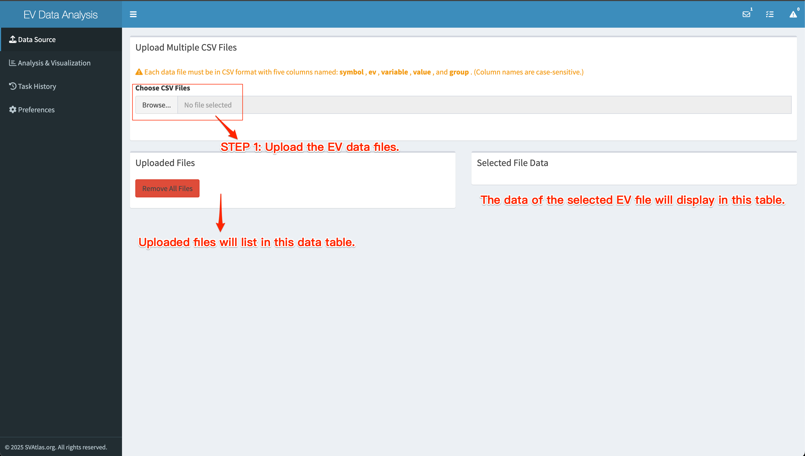

# Introduction

SVAtlas provides a comprehensive workflow with three integrated tools for single-EV analysis, enabling automated processing of raw matrices into interactive visualizations without external software. Users can re-analyze SVAtlas datasets or upload their own data (format: symbol, EV, variable, value, group) to perform heterogeneity analysis and explore molecular profiles.

This repository contains the source code for the EV data analysis tool, one of the integrated tools, which is built using R and Shiny. The application allows users to upload their single-EV data, perform clustering and dimensionality reduction, and visualize the results through various interactive plots.

## Installation

You can install the required R packages using the following command:

```R
if (!requireNamespace("BiocManager", quietly = TRUE))
    install.packages("BiocManager")

BiocManager::install("flowCore")
BiocManager::install("FlowSOM")

install.packages(c("shiny", "shinydashboard", "DT", "ggplot2", "dplyr", "tools", "jsonlite", "shinyjs", "cookies", "promises", "future", "progressr", "data.table", "tidyr", "stringr", "Matrix", "ConsensusClusterPlus", "Rtsne", "umap", "RColorBrewer", "Biobase", "reshape2", "uuid"))
```

## How to Run Locally

1. Clone the repository to your local machine.
2. Open RStudio and set the working directory to the cloned repository.
3. Open the `app.R` file.
4. Run the application by clicking the "Run App" button in RStudio or by executing the following command in the R console:
    ```R
    shiny::runApp()
    ```
5. The application will open in your default web browser.
6. Upload your single-EV data file in the specified format (symbol, EV, variable, value, group). A demo dataset ["Alzheimer's Disease"](http://localhost:8080/R/evData.zip) is also available for testing.
   
7. After uploading the data, you can select the analysis parameters, and then click "Run Analysis" to perform the analysis.
   
8. Once the analysis is complete, you can download the resulting plot and t-SNE data file, or further explore the results through an interactive visualization by clicking the “Explore the t-SNE Result” button.

## Live Demo

A live demo of the application is available at: [EV Data Analysis Live Demo](http://ev.svalatlas.org/).

## Dependencies

- R (>= 4.3.0)
- R packages:
  - shiny
  - shinydashboard
  - DT
  - ggplot2
  - dplyr
  - tools
  - jsonlite
  - shinyjs
  - cookies
  - promises
  - future
  - progressr
  - data.table
  - tidyr
  - stringr
  - Matrix
  - FlowSOM
  - flowCore
  - ConsensusClusterPlus
  - Rtsne
  - umap
  - RColorBrewer
  - Biobase
  - reshape2
  - uuid